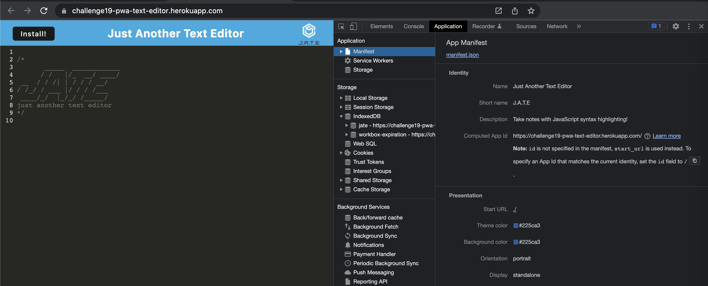
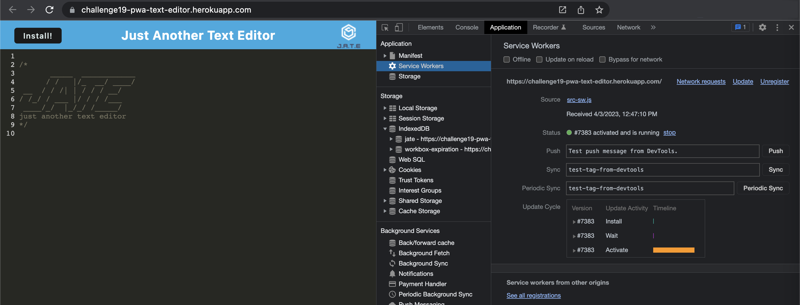
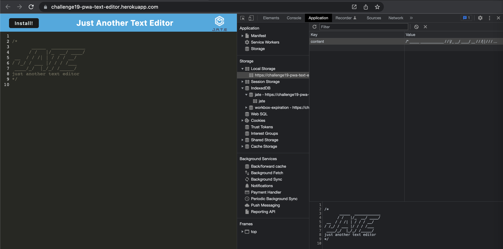

# Module 19 Challenge - Progressive Web Application (PWA): Text Editor

>**Application Link:** [J.A.T.E](https://challenge19-pwa-text-editor.herokuapp.com/)
>
>**View:** [Description](#description) / [Application Details](#application-details) / [Application Previews](#application-previews)
>
>**Application Video Preview:**
>
>
> 
## **DESCRIPTION**
> Topic Assessed: **sequelize & ORM** - **sequelize get, post, put, delete API Requests, sequelize Models, dotenv connection, etc.**
### **My Task**
*J.A.T.E* is a progressive web application that allows a user to add and edit text online and offline.
> Modify starter code and deploy application to heroku.
> 
> Use IndexedDB to create an object store and complete GET and PUT methods.
>
> Bundled application with webpack.
>
> Create a service worker with workbox that Caches static assets.
>
> Generated manifest.json using the WebpackPwaManifest plug-in.
> 
## User Story
```
AS A developer
I WANT to create notes or code snippets with or without an internet connection
SO THAT I can reliably retrieve them for later use
```
## Acceptance Criteria
```
GIVEN a text editor web application
WHEN I open my application in my editor
THEN I should see a client server folder structure
WHEN I run `npm run start` from the root directory
THEN I find that my application should start up the backend and serve the client
WHEN I run the text editor application from my terminal
THEN I find that my JavaScript files have been bundled using webpack
WHEN I run my webpack plugins
THEN I find that I have a generated HTML file, service worker, and a manifest file
WHEN I use next-gen JavaScript in my application
THEN I find that the text editor still functions in the browser without errors
WHEN I open the text editor
THEN I find that IndexedDB has immediately created a database storage
WHEN I enter content and subsequently click off of the DOM window
THEN I find that the content in the text editor has been saved with IndexedDB
WHEN I reopen the text editor after closing it
THEN I find that the content in the text editor has been retrieved from our IndexedDB
WHEN I click on the Install button
THEN I download my web application as an icon on my desktop
WHEN I load my web application
THEN I should have a registered service worker using workbox
WHEN I register a service worker
THEN I should have my static assets pre cached upon loading along with subsequent pages and static assets
WHEN I deploy to Heroku
THEN I should have proper build scripts for a webpack application
```
## **APPLICATION DETAILS**

### Client Information
* **src/js**: Defined external and local packages used.
  * `database`
    * initdb: create `jate ` database if non existent.
    * putDb: update content in database.
    * getDb: get content from database to populate application at launch.
  * `editor`:
    * CodeMirror: used to set application format and styling
    * getDb: get and populate data from index db.
      * if database is null, populate data from local storage.
      * if local storage is null, populate data from header.
    * on 'change': update local storage and database.
    * on 'blur': updata database with local storage.
  * `install`: eventlistener to launch install prompt.
* **src-sw**: Set up service worker and page cache
* **webpack.config**: Define webpack output settings ans css loaders.
  * mode: development
  * path: dist
  * plugins:
    * HTMLWebpackPlugin
    * InjectManifest
    * WebpackPwaManifest
  * css loader: babel-loader
* **package.json**:
  * Dependencies: 
    * [code-mirror-themes](https://www.npmjs.com/package/code-mirror-themes), version ^1.0.0
    * [idb](https://www.npmjs.com/package/idb), version ^6.1.2
  * devDependencies:
    * [@babel/core](https://www.npmjs.com/package/@babel/core), version ^7.15.0
    * [@babel/plugin-transform-runtime](https://www.npmjs.com/package/@babel/plugin-transform-runtime), version ^7.15.0
    * [@babel/preset-env](https://www.npmjs.com/package/@babel/preset-env), version ^7.15.0
    * [@babel/runtime](https://www.npmjs.com/package/@babel/runtime), version ^7.15.3
    * [babel-loader](https://www.npmjs.com/package/babel-loader), version ^8.2.2
    * [css-loader](https://www.npmjs.com/package/css-loader), version ^6.2.0
    * [html-webpack-plugin](https://www.npmjs.com/package/html-webpack-plugin), version ^5.3.2
    * [http-server](https://www.npmjs.com/package/http-server), version ^0.11.1
    * [style-loader](https://www.npmjs.com/package/style-loader), version ^3.2.1
    * [webpack](https://www.npmjs.com/package/webpack), version ^5.51.1
    * [webpack-cli](https://www.npmjs.com/package/webpack-cli), version ^4.8.0
    * [webpack-dev-server](https://www.npmjs.com/package/webpack-dev-server), version ^4.0.0
    * [webpack-pwa-manifest](https://www.npmjs.com/package/webpack-pwa-manifest), version ^4.3.0
    * [workbox-webpack-plugin](https://www.npmjs.com/package/workbox-webpack-plugin), version ^6.2.4

### Server Information
* **routes**:
  * `htmlRoutes`: Define html path as '../client/dist/index.html'.
* **server.js**: Defined the default port as 3000.
* **package.json**: Define the dependencies/packages used in the server end.
  * Dependencies: 
    * [express](https://www.npmjs.com/package/express), version ^4.17.1
  * devDependencies:
    * [nodemon](https://www.npmjs.com/package/nodemon), version ^2.0.4

### Application Information
* **package.json**: Define the dependencies/packages used in the application.
  * Dependencies: 
    * [express](https://www.npmjs.com/package/express), version ^4.17.1
    * [if-env](https://www.npmjs.com/package/if-env), version ^1.0.4
  * devDependencies:
    * [concurrently](https://www.npmjs.com/package/concurrently), version ^5.2.0
    * [nodemon](https://www.npmjs.com/package/nodemon), version ^2.0.4


## **APPLICATION PREVIEWS**
### Manifest
>
>
### Service Worker
>
>
### Local Storage & IndexDB 'jate'
>